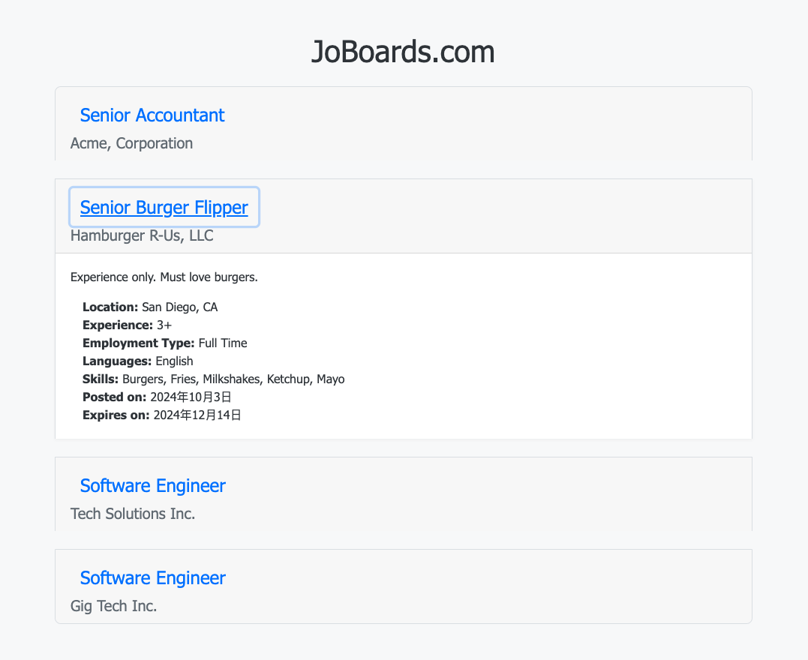

# JobPoster Project

This project is a practice for fetching jobs data from a backend API and displaying it in a web client. The project consists of two parts:
- **Backend**: A Node.js server that provides job data.
- **Frontend**: A client-side application that fetches job data and displays it in the browser.

## Preview




## Project Structure

```
hw6-job/
│
├── joboards-client/       # Frontend (client-side)
│   ├── index.html         # Main HTML file
│   ├── index.js           # Client-side JS file
│   ├── styles.css         # Stylesheet
│   └── modules/jobs/      # JS modules for job models and fetching
│       ├── job.model.js   # Job model
│       └── jobs.module.js # Job fetching module
│
├── joboards-server/       # Backend (server-side)
│   ├── jobs.json          # JSON file containing job data
│   ├── server.js          # Node.js server
│   └── .env               # Environment variables for the server
│
├── package.json           # Main project setup and scripts
└── README.md              # Project documentation (this file)

```

## Prerequisites

Before running the project, ensure you have the following installed:

- [Node.js](https://nodejs.org/en/download/) (v14 or higher)
- [npm](https://www.npmjs.com/get-npm)

## Setup

1. Clone this repository or download the project files.
2. Navigate to the project root directory:
   ```bash
   cd hw6-job

	3.	Install dependencies by running the following command in the root directory:

npm install


Running the Project

You can run both the client and the server concurrently using a single command:

	1.	Start both the server and client:

npm start


This will do the following:

	•	The Backend server will run on port 3000 by default (specified in server.js).
	•	The Frontend will be served using live-server on port 8080.

Access the Application

Once you run the project with npm start, the client will be accessible at:

http://localhost:8080

The backend server (API) will be accessible at:

http://localhost:3000

Additional Notes:

	•	You can customize the backend port or other settings by editing the .env file inside the joboards-server directory.
	•	The frontend uses live-server, which automatically reloads the page when files are changed in the joboards-client directory.

Scripts

The following scripts are available in the project:

	•	npm start: Runs both the frontend and backend concurrently.
	•	npm run server: Runs only the backend server.
	•	npm run client: Runs only the frontend using live-server.

License

This project is licensed under the MIT License - see the LICENSE file for details.

### Key Sections:
- **Project Structure**: Provides an overview of the folders and files.
- **Setup**: Explains how to install dependencies.
- **Running the Project**: Shows how to run both the client and server with a single command (`npm start`).
- **Scripts**: Lists additional npm scripts for running the frontend or backend individually.
